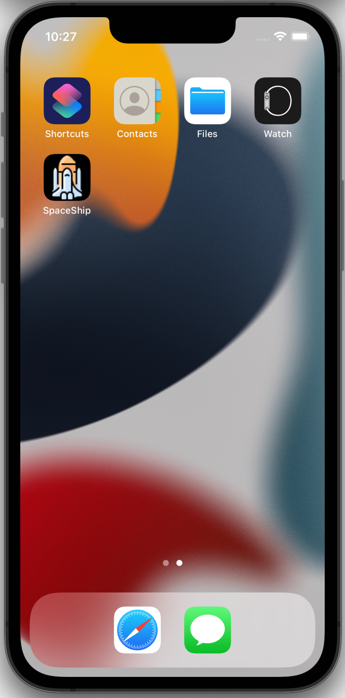
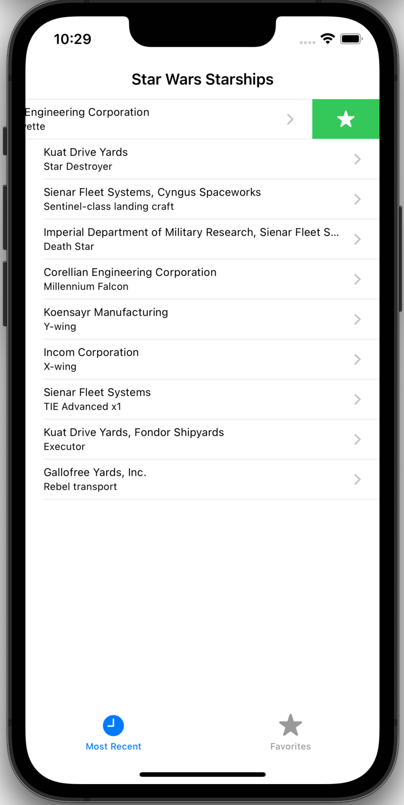
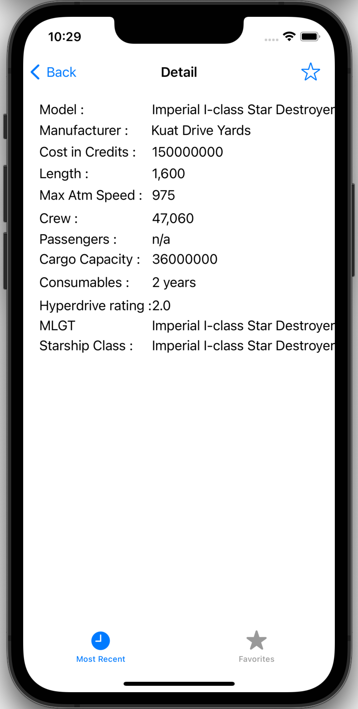
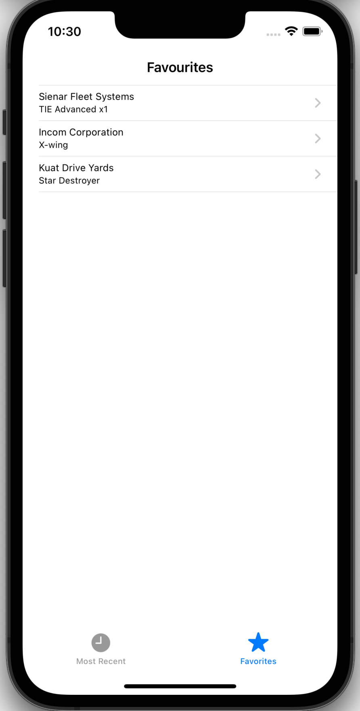

 

  

  <h3 align="center">SpaceShip</h3>

  

    A simple application that displays a collection of Star Wars starships.
     
  

<!-- ABOUT THE PROJECT -->
## About The Project

Build a simple application that displays a collection of Star Wars starships and allows the user to “favourite” the starships that appeal to them. 

Requirements  
• Fetch a single page of data from the following API: https://swapi.dev/api/starships/  
• Display the collection of starships. On this screen present 2+ properties for each 
• Allow the user to click on a starship to view more details about it.  
• Users should be able to “favourite” starships from both screens. Don’t worry about 
• persistence across sessions (DB/SharedPrefs/etc); in-memory is fine. However
• consider that the solution might be extended in the future to support this. 
• Use any third-party libraries to help with your implementation 
• Concise, understandable code. Try not to over-engineer, however the solution should be maintainable and production ready. 
• Document any UX/UI/architecture/requirements assumptions 

    

    

    

    

